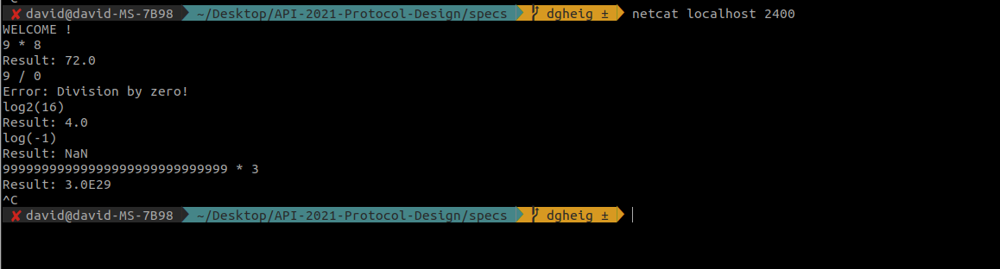

# Specification

## Protocol objectives:

> What does the protocol do?

This is a "[exp4j](https://www.objecthunter.net/exp4j/) as a service"

## Overall behavior:

- What transport protocol do we use?
  Le protocole TCP

- How does the client find the server (addresses and ports)?
  L'adresse sera connue, le port fixé à 2400

- Who speaks first?

  Le serveur commence la communication en envoyant "WELCOME !"

- Who closes the connection and when?
  C'est le client qui ferme la connection, sauf en cas d'erreur.

## Messages:

- What is the syntax of the messages?

  L'application ne permet que de faire des calculs sans mémoire/historique. Les opérations supportées et la syntaxe sont définies par la librairie [exp4j](https://www.objecthunter.net/exp4j/)

  Le serveur lui envoie ensuite:

  * "Result: " suivi de la valeur
  * "Error: " suivi du message d'erreur

- What is the sequence of messages exchanged by the client and the server? (flow)

  Le client et le serveur s'alternent

- What happens when a message is received from the other party? (semantics)

  

## Specific elements (if useful)

- Supported operations; All operations supported by [exp4j](https://www.objecthunter.net/exp4j/), except the one requiring history or variables
- Error handling: The message starts with "Error: " followed by the error message.
- Extensibility

## Examples: examples of some typical dialogs.

